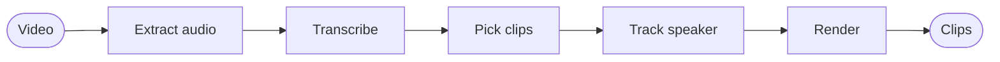

<p align="center">
  <h1 align="center">DigiClip CLI</h1>
</p>

<p align="center">
  <strong>Drop a video, get TikTok-ready clips — from the terminal.</strong><br />
  The clipping engine behind <a href="https://github.com/n1ssyyy/DigiClip">DigiClip</a>:
  offline transcription, smart clip picking, and captioned 9:16 renders.
  One portable exe, no cloud render farm required.
</p>

<p align="center">
  <a href="https://github.com/n1ssyyy/DigiClip-CLI/actions/workflows/ci.yml">
    
  </a>
  <a href="https://github.com/n1ssyyy/DigiClip-CLI/releases/latest">
    
  </a>
  <a href="https://github.com/n1ssyyy/DigiClip-CLI/blob/main/LICENSE">
    
  </a>
</p>

<p align="center">
  
  
  
  
  
</p>

<p align="center">
  <a href="https://github.com/n1ssyyy"></a>
  <a href="https://github.com/n1ssyyy/DigiClip"></a>
</p>

---

<h3 align="center">One binary. Any long video. Clips worth posting.</h3>

<p align="center">
  The engine behind <a href="https://github.com/n1ssyyy/DigiClip">DigiClip</a>, unleashed in your terminal:<br />
  it listens, finds the moments, frames the speaker and renders captioned vertical clips — offline.
</p>

```bash
digiclip podcast.mp4
# → 3 captioned 9:16 clips, transcript, subtitles and upload kits. That's it.
```

## ⚡ Why it rips

- 🎙️ **Transcribes offline.** whisper.cpp is compiled right in — word-level timing, no Python, no upload. Got a GPU? Plug in the Vulkan sidecar.
- 🎯 **Picks like an editor.** A model of your choice ([OpenRouter](https://openrouter.ai), OpenAI, Anthropic, Gemini, Ollama, Groq and more) ranks every moment for hook and payoff; a built-in scorer covers you offline. A System One model then re-judges each candidate with calibrated odds (hook, standalone, complete, value, shareability): TypeSafe's hosted **Jev**, or **Laya** running locally on your CPU.
- 🎥 **Frames like a camera operator.** YuNet face tracking plus an offline camera planner: the shot locks off while the speaker stays put, follows a walking presenter in one smooth move, cuts (never whip-pans) between speakers, and lands every reframe on the source's own shot cuts.
- ✂️ **Tightens the edit.** Dead air goes, filler words optionally too; every cut is placed in the quietest instant near the word edge, frame-aligned, with click-free audio joins. Loud lines get a punch-in zoom anchored on the face — every cut logged in `cut_plan.json`.
- 💬 **Eight caption styles.** Karaoke, Hormozi, neon, beast and friends, burned in with libass.
- 🧩 **Any platform, your brand.** 9:16, 4:5, 1:1 or 16:9 from the same source, with an optional headline, progress bar, corner logo and a music bed that ducks under the voice.
- 🚀 **Renders in parallel, in sync.** A streaming decode → compose → encode pipeline, clips side by side on NVENC or VideoToolbox (libx264 fallback). A/V sync is exact by construction and loudness lands on −14 LUFS with a −1 dBTP ceiling.
- 🔒 **Stays local.** Your video never leaves the disk; only clip scoring optionally calls your chosen AI provider or Jev (Laya never leaves the machine).



### How the engine works

- **Cuts.** Clip and keep edges snap to word boundaries, then into the quietest nearby instant (a short lead-in before the first word, a natural tail after the last), then onto the output frame grid. Audio is cut by exact sample counts on the same grid, with short fades at every join, so video and audio can't drift apart however many jump cuts a clip has.
- **Tracking.** Faces are sampled at 8–15 Hz. Shot cuts are verified (a one-frame spike, not a pan) and pinned to the exact frame. A speaker who walks or drops out of detection for a moment stays the same person, and the camera switches only between different people who are talking.
- **Camera.** The whole clip is planned before the first frame renders. The camera holds inside a dead zone, cuts on shot changes, speaker switches and layout changes, glides (smootherstep) for everything else, and follows continuous motion with zero-phase smoothing. Zoom never goes past the source resolution, so low-res input stays sharp.
- **Render.** One ffmpeg decode per keep feeds a Rust compositor (crop, scale, blur fill), which feeds one encoder with captions burned in. The audio uses two-pass loudness and a limiter.

## 📥 Get it

Download your binary from the [latest release](https://github.com/n1ssyyy/DigiClip-CLI/releases/latest) — `digiclip-win-x64.exe`, `digiclip-linux-x64` or `digiclip-macos-arm64` — and run it.

- 🎞️ **ffmpeg with libass** — Windows downloads it on first run; macOS `brew install ffmpeg`; Linux `sudo apt install ffmpeg`.
- 🪟 Windows needs the [Visual C++ Redistributable (x64)](https://aka.ms/vs/17/release/vc_redist.x64.exe) (most PCs already have it).
- 🐧 Linux needs glibc 2.38+ (Ubuntu 24.04+, Debian 13+, Fedora 39+). 🍎 macOS: Apple Silicon.

The first run grabs what it needs — whisper model, face model, ffmpeg on Windows — then it works offline for good. `digiclip --provision` fetches it all up front.

## 🚀 Use it

```bash
digiclip input.mp4                              # 3 clips, karaoke captions
digiclip input.mp4 --mode full                  # the whole video, subtitled
digiclip input.mp4 --framing smart              # follow the speaker
digiclip input.mp4 --count 5 --style hormozi    # more clips, louder captions
digiclip input.mp4 --min-len 20 --max-len 45    # clip length window (default 15–90s)
digiclip input.mp4 --tighten punchy             # also cut filler words
digiclip input.mp4 --merge                      # stitch the picks into one supercut
digiclip input.mp4 --dry-run                    # plan it, don't render
digiclip input.mp4 --focus "pricing, AI agents" # steer picks toward a topic
digiclip ./videos/ --out-dir clips/             # a whole folder, one video after another
```

Everything lands in `<input-name>-digiclip/`: `clip-01-9x16.mp4` with its `.ass`/`.srt` captions and upload kit, plus `transcript.json/.srt` and `clips.json`. `digiclip --help` lists every knob.

### Make it yours

```bash
digiclip input.mp4 --aspect 1:1                 # also 4:5 (feed) and 16:9 (YouTube)
digiclip input.mp4 --headline                   # clip title pinned on top (or --headline "Your text")
digiclip input.mp4 --caption-anim words         # caption motion: pop (default), words, none
digiclip input.mp4 --look '{"captions":{"x":0.5,"y":0.25,"size":1.4}}'   # place and style the captions (or --look @look.json)
digiclip input.mp4 --look '{"captions":{"words":{"spoken":{"color":"#888888","opacity":0.7},"active":{"scale":1.15,"lift":0.06},"release_ms":400},"enter":{"kind":"slide_up","ms":200}}}'   # word-by-word captions: the spoken words trail off, the active word lifts, the line slides in
digiclip input.mp4 --headline "Why most founders quit" --progress-bar "#FFD400" --look '{"headline":{"x":0.5,"y":0.7,"card":"none","seconds":3},"bar":{"pos":"top","height":2}}'   # move the headline and the progress bar (look.logo does the same for --logo)
digiclip input.mp4 --look '{"camera":{"feel":"steady","zoom":1.15},"effects":{"grade":"warm","vignette":0.4,"fill_dim":0.6}}'   # calmer, tighter camera and a gentle warm grade (look.layout.split moves the split-screen seam)
digiclip input.mp4 --progress-bar               # watch-time bar along the bottom (or --progress-bar "#00E5FF")
digiclip input.mp4 --headline --progress-bar --look '{"headline":{"font":"Anton","card":{"color":"#101826","opacity":0.7,"radius":1},"glow":{"color":"#00E5FF","size":16},"enter":{"kind":"slide_down","ms":400},"exit":{"kind":"blur"},"delay_s":0.5,"seconds":4},"bar":{"inset":0.04,"radius":1,"track":"#FFFFFF","track_opacity":0.3,"glow":{"size":14}}}'   # a dressed headline and bar (look.logo takes rotate, shadow and glow)
digiclip input.mp4 --look '{"captions":{"font":"Bebas Neue"},"headline":{"font":"DM Serif Display"}}'   # fifteen fonts are bundled and you can add your own: `digiclip fonts` lists them (see Fonts)
digiclip input.mp4 --logo logo.png --logo-pos br   # corner logo: tl, tr (default), bl, br
digiclip input.mp4 --music bed.mp3 --music-db -12  # looped music bed, ducked under speech
```

- **Aspect.** The tracker, camera, captions and blur fill all work on the chosen canvas, and files are named after it (`clip-01-1x1.mp4`). Captions move to the lower third on non-vertical canvases, so they stay off faces.
- **Headline.** A white title card shown for the whole clip, top centre, below the platform's top bar: at most two balanced lines, one accented word, a quick pop-in. Bare `--headline` uses each clip's title (the AI picker writes a 3–7 word headline); offline, a short self-contained sentence from the clip's first seconds, or no headline when nothing reads well on its own.
- **Headline, bar and logo depth.** `look.headline`, `look.bar` and `look.logo` take the same kind of fields as the captions. Every field is optional; leave them all out and the render is the one you had, byte for byte. Lengths are px on a 1080 wide canvas (they scale with the canvas, like the captions'), `em` means a share of the type size. Out-of-range numbers are clamped, wrong types and unknown names are dropped, and an object left with nothing in it is no object. The capabilities `look.headline.v2`, `look.bar.v2` and `look.logo.v2` announce them.
  - **Headline.**
    - Type: `font` (any family of [Fonts](#-fonts), bundled or your own; default `Archivo Black`), `case` (`upper` or `asis`), `spacing` (−0.05–0.3 em after every character), `align` (`left`, `center`, `right`, inside the block), `max_lines` (1–3, default 3 when the text needs it) and `width` (0.4–1, the widest the text block may be, as a share of the frame width; default is today's room, the frame minus its side margins and the logo's corner).
    - `stroke` (`{color, width}`, 0–12 px), `shadow` (`{color, x, y, blur, opacity}`, offsets −30–30, blur 0–20, opacity 0–1) and `glow` (`{color, size, strength}`, size 0–40, strength 0–1) mean what the caption fields of the same name mean, with the same defaults: a glow is the text grown by 0.55 of `size` and blurred by 0.6 of it, a shadow is a separate blurred copy of the text. Layer order, bottom to top: card, shadow, glow, text; all four are above the captions. Bare type (`card: "none"`) keeps its dark edge unless `stroke` says otherwise; a card has no stroke unless `stroke` asks for one.
    - `card` is a `#RRGGBB` (v1), `"none"` (v1), or an object `{color, opacity, pad, radius}`: `opacity` 0–1 (0 is no card), `pad` 0–80 px on every side (default 24 × `size`), `radius` 0–1 as a fraction of half the card's shorter side (0 is square, 1 is a pill). One card wraps every row. It always stays inside the frame, whatever `x`, `y` and `size` ask.
    - `accent_word`: `auto` (the word the headline accents today), `first`, `last` or `none`. The accent colour is the v1 `accent`.
    - `enter` (`kind` `none`, `pop`, `fade`, `slide_up`, `slide_down`, `slide_left`, `slide_right`, `zoom`, `bounce`, `blur`, `drop`; `ms` 0–800; `ease` `linear`, `out`, `in`, `back`) and `exit` (`kind` `none`, `fade`, `slide_up`, `slide_down`, `zoom`, `blur`; `ms` 0–600) are the captions' own entrances and exits, applied to card, shadow, glow and text together. The v1 `anim` stays as a shorthand for `enter` (`pop` is a 340 ms pop, `fade` a 200 ms fade, `none` no motion); an explicit `enter` wins. A headline that ends before the clip does fades out over 200 ms unless `exit` says otherwise; an `exit` with a time and no kind is a fade.
    - `seconds` keeps its meaning, the time on screen, and `delay_s` (0–5) shifts the start: the headline comes in at `delay_s` and stays `seconds`, or to the end of the clip. A delay at or past the end of the clip draws nothing.
    - Which writer draws it: the one-event writer of before as long as the Look holds only the v1 fields (`x`, `y`, `size`, `ink`, `accent`, `anim`, `seconds`, and `card` as a colour or `none`); the word-level writer, which lays the rows out from the font's metrics and draws every word, as soon as any other field is there (a `card` object counts). `x`, `y` and `size` mean the same in both: `x`/`y` centre the card (by default it sits at the top below the platform's bar), `size` multiplies the type and the default padding.
    - Rows: a text longer than 18 characters is spread over two balanced rows (as today), at most `max_lines`; a short one stays on one row. When `width` is too narrow for `max_lines` rows the block widens up to what the card leaves of the frame, and only when even that is not enough does the headline lose words from its end (never ending on a word that hangs), as the one-event writer does for its 48-character limit. The headline text is still cut at 48 characters.
  - **Progress bar.** `color` (`#RRGGBB`, wins over the flat `--progress-bar` colour, which still switches the bar on; the Look alone never does), `track` (the unfilled colour) and `track_opacity` (0–1: a `track` alone is 55 %, an opacity alone is the dark track at that strength, neither leaves today's dimmed picture), `inset` (0–0.1: the margin from the left, right and the edge it sits on, as a share of the frame width), `radius` (0–1, a fraction of half the bar's thickness: rounds the ends of the track and the leading end of the fill, with antialiased edges) and `glow` (`{color, size, strength}`, a soft halo of the fill, in the fill's colour unless `color` is given, grown and blurred like a caption glow; it follows the fill's end and stays within its own reach of the bar). Order, bottom to top: picture, track, glow, fill. Vignette and grade are applied before the bar, so the bar keeps its colours. A bar with none of `track`, `track_opacity`, `inset`, `radius`, `glow` is drawn by the old code, pixel for pixel.
  - **Logo.** `rotate` (−30–30 degrees, positive clockwise, about the logo's centre, keeping its transparency), `shadow` and `glow` (as above; a glow with no colour is white). Shadow and glow follow the shape of the logo's own transparency, not its box. Each is made from the logo's alpha in the encoder graph, stacked shadow, glow, logo, and the stack takes the logo's `opacity` once. The logo keeps its centre where it would have been without them (corner or `x`/`y`). A turn under 0.01 degrees is no turn.
  - Limits, nothing left out: the logo glow grows the shape with one-pixel steps that alternate square and diamond, so it is round to within a pixel or two, not exact; `bar.glow` and the bar's `radius` are computed per frame for the fill only and cost nothing outside the bar's rows and the halo's reach; the word-level headline needs the font's metrics (every bundled font and every font you add has them; an OpenType/CFF font's ink box is estimated, see [Fonts](#-fonts)).
- **Alpha.** Every colour in a Look is `#RRGGBB` or `#RRGGBBAA` (`AA` is the opacity: `FF` opaque, `00` clear; the flat `--progress-bar` colour too), and `look.captions`, `look.headline`, `look.bar` and `look.logo` take `opacity` (0–1, default 1; the logo's own default is 0.9) for the whole element. Six-digit colours and an opacity of 1 render as they always did; opacity 0 draws nothing. Alpha is applied part by part and multiplied: a part's opacity is its colour's alpha × its own opacity number (`box.opacity`, `card.opacity`, `track_opacity`, `shadow.opacity`, `glow.strength`, `words.<state>.opacity`) × whatever fades it over time (entrance and exit, word attack and release) × the element's `opacity`. ASS has no group opacity, so a half-transparent fill shows its own stroke and shadow through it and overlapping glyph parts add up; the rule per part is in the header of `src/look.rs`. The bar is laid over the frame in straight alpha, bottom to top picture, track, glow, fill; the logo's shadow, glow and image are stacked as rasters and the stack takes `logo.opacity`. `vignette` and `fill_dim` are strengths (their own opacity); `grade` has no alpha. The capability is `look.alpha`.
- **Caption motion.** `pop` (default): each line pops in and fades out, keywords bump as they're spoken, lines never flash for a split second or run across a sentence end. `words`: the same, with words appearing one by one as they're spoken. `none`: static lines, as before.
- **Word-level captions.** `look.captions` takes three optional sections that give every word its own small timeline. Leave them out and the captions render exactly as before; `words: {}` changes nothing either.
  - `words.mode`: `all` (every word of the line is on screen from the start, the default), `build` (a word appears when it is spoken, and the line keeps its final layout, so nothing shifts as words arrive), `single` (one word at a time at the caption position, each up until the next word starts).
  - `words.upcoming`, `words.active`, `words.spoken` are the three looks a word goes through: not yet spoken, being spoken, already spoken. Each takes `color`, `opacity` (0–1) and `scale` (0.5–1.5); `upcoming` and `spoken` also take `blur` (0–10, px at 1080 wide), and `active` also takes `lift` (−0.3–0.3, in em of the font size; positive is up) and `rotate` (−10–10 degrees; positive is clockwise), both about the word's centre. A field that does not belong to a look is dropped. Anything left out is the style's own look: upcoming is the style's unsung colour, active its sung colour, spoken keeps the active colour, and opacity and scale are 1.
  - `words.keyword` (`color`, `scale`) is the look of the words the engine already treats as keywords (numbers, power words such as `never` or `free`, capitalised words inside a sentence). A keyword is lit in `keyword.color` (default: the style's accent, or your v1 `accent`) instead of the active colour, and keeps that colour once spoken unless you set `spoken.color`. `keyword.scale` multiplies the active and spoken scale of a keyword and replaces the pop entrance's keyword bump.
  - `words.fill`: `snap` (the active colour appears at once, default) or `sweep` (it wipes left to right across the word over the word's own length; only when the active colour differs from the upcoming one).
  - Timeline, in ms from the word's own start: the attack (`attack_ms`, 0–400, `attack_ease`) begins exactly when the word starts and takes the word from upcoming to active; it stays active until the word ends plus `hold_ms` (0–600) and never leaves before the attack is done; then the release (`release_ms`, 0–2000, `release_ease`) takes it to spoken. Releases overlap the next word's attack freely, so several words can be mid-release at once (a trail). A release that would run past the end of the line is cut there. Defaults: attack 0 (80 for `build`), hold 0, release 0, eases `out`. Eases are `linear`, `out`, `in` and `back` (a small overshoot; on colour and opacity it behaves as `out`).
  - `enter` (`kind`, `ms` 0–800, `ease`) is how the line comes in: `none`, `pop`, `fade`, `slide_up`, `slide_down`, `slide_left`, `slide_right`, `zoom`, `bounce`, `blur`, `drop`. `exit` (`kind`, `ms` 0–600) is how it leaves: `none`, `fade`, `slide_up`, `slide_down`, `zoom`, `blur`. In `single` mode each word enters and leaves. `ease` shapes slides, zoom, blur, drop and fade; `pop` and `bounce` have their own shapes (a `pop` given an ease scales from 84% by that ease; `bounce` ignores it). Without `enter`/`exit` the line uses what its `anim` stood for before: `pop` is pop 200 ms + fade 60 ms, `words` is `mode: build` with the same pop, `fade`, `slide` and `bounce` are the matching enter, `none` is neither; `--caption-anim` means what it always did, and an explicit `words.mode`, `enter` or `exit` wins over it.
  - The v1 fields are the defaults of the new ones: `color` is `upcoming.color`, `active` is `active.color`, `accent` is `keyword.color`; the new field wins when both are given. Out-of-range numbers are clamped, wrong types and unknown names are dropped, and a section left with nothing in it is no section.
  - The line stays put: it is laid out once from the font's metrics, with room kept for the biggest scale each word reaches, and every word is drawn where its slot is, so scale, lift and tilt never push the neighbours or re-wrap the line. The cost is more caption events: twelve words of a pop caption go from 5 events to about 48 (four per word), a `build` of them to about 32, a `single` one to 12, and with a `lift` to about 136, because a moving word is cut into short straight moves.
  - **Dressing.** More optional fields of `look.captions` change how the letters are drawn. All work on all eight styles and on every canvas; leave them out and the captions render exactly as before.
    - Type: `spacing` (−0.05–0.3, extra space after every character, in em), `line_gap` (0.8–1.6, line height as a multiple of the font's own), `lines` (`1` or `2`: never wrap, or at most two rows), `max_chars` (6–40, a hard limit of characters per block, spaces included; it replaces the style's own budget and `max_words` then only caps the words, default 8), `align` (`left`, `center`, `right`: the rows of a block are justified inside it; the block itself stays centred on `x`, so it only shows on blocks of two or more rows) and `rotate` (−15–15 degrees, clockwise, the whole block turned about its middle).
    - `stroke` (`{color, width}`, width 0–12 px at 1080 wide) is the outline; the object wins over the v1 `outline` and `outline_w`. `shadow` is the v1 number or an object `{color, x, y, blur, opacity}` (offsets −30–30 px, `blur` 0–20 px, `opacity` 0–1; defaults: black, x 0, y 4, blur 4, opacity 0.6) drawn as a copy of the text under it. `glow` (`{color, size, strength}`, size 0–40 px, strength 0–1; defaults: the letters' own colour or white when it is dark, 12 px, 0.8) is a halo: a copy of the text grown by 0.55 of `size` and blurred by 0.6 of `size`, at `strength` opacity. `box` is the v1 `"#RRGGBB"` or `"none"`, or an object `{color, opacity, pad_x, pad_y, radius, per}` (padding 0–60 px; `radius` 0–1 is the fraction of half the box's shorter side, 1 being a pill; `per` is `line`, the default, or `word`), drawn as a vector shape sized from the glyph outlines, so its outer edge hugs the ink.
    - `words.active.stroke`, `words.active.glow` and `words.active.box` (`{color, opacity, radius}`) dress the word being spoken, and `words.keyword.glow` the keywords; they come in with the word's attack and go with its release, back to the caption's own `stroke` and `glow`, and the box of the active word follows its scale, lift and tilt. A keyword keeps its `words.keyword.glow` once spoken, as it keeps its colour. The same fields on `upcoming` and `spoken` are dropped.
    - Layer order, bottom to top: box, shadow, glow, text. The copies are separate events that repeat the text's position, scale, tilt, blur and fade for every slice of the word, so they follow every animation of their word or line. Rows whose words look alike share one shadow or glow event; a row with word states gets one copy per word. A caption with a Look `box`, `shadow` or `glow` object is drawn by the word-level writer, so twelve words with everything on (stroke, shadow, glow, a per-word box, an active scale, lift, glow and box, a 400 ms release, enter and exit) come to about 700 events, 250 of them boxes and 150 each of shadows, glows and text; without such a field, nothing about the cost changes.
    - Which writer draws: the line writer as before when the Look has none of `words`, `enter`, `exit` and the fields above; the word-level writer as soon as it has one. A v1 `box` colour, `box_opacity`, `outline`, `outline_w` and a number `shadow` keep the line writer.
    - The default look of `hormozi` and `highlight` changed in one way: their box is now one clean box per line. Before, the translucent boxes of neighbouring runs overlapped for a few frames while a line faded, which left a darker seam; the outer edge moved by at most 2 px and the colour, opacity and letters are the same.
  - Every field above is implemented. Limits: `align` has no effect on a block of one row; a `sweep` is a left-to-right wipe over the word's length and does not follow `attack_ms`; `bounce` has a fixed shape and ignores `enter.ease`. No field of the contract is left out, so none is ignored.
- **Logo.** A PNG or JPEG, sized to one box whatever its shape (square mark or wide wordmark) and slightly translucent. The headline and captions keep clear of its corner.
- **Camera.** `feel` sets how the virtual camera moves: `smooth` (default), `steady` (wider dead bands and a slower response, so it moves less often and more gently), `lively` (narrower bands, quicker response) or `locked` (one framing per shot, held; cuts between shots still reframe). `zoom` (0.8–1.4) is how tight the face framing is, within the resolution limit and never wider than the full-height window; `punch` (1–1.4) is the peak scale of the emphasis punch-ins (1 = none), while punch-ins are on.
- **Effects.** `vignette` (0–1) darkens the corners, `grade` is one of `warm`, `cool`, `mono` or `punchy` (all gentle), `fill_dim` (0–1) sets how dark the blurred fill behind letterboxed video is (0.4 is the default look). Vignette and grade touch the picture only: captions, headline, logo and the progress bar keep their exact colours.
- **Layout.** `split` (0.3–0.7) is the top panel's share of the height in the split-screen layout (0.5 = an even split); the captions stay on the seam.
- **Music.** Normalised to `--music-db` below the speech (default −16), looped to length, faded in and out, and ducked by roughly 6–9 dB while someone talks. The mix still lands on −14 LUFS.
- **Focus.** The LLM is told the topic, the offline scorer boosts sentences that mention it, and every candidate that covers it ranks first. When nothing matches, the best clips overall are used.
- **Batch.** Pass several files or a folder. Each video gets its own `<name>-digiclip/` folder, under `--out-dir` when given. If one video fails, the rest still run and the run exits with an error that lists the failures.

### 🔤 Fonts

`look.captions.font` and `look.headline.font` take any listed family, bundled or your own, by name (case does not matter). A name that is not installed is ignored, as before: the style's own font is used, and the engine says so in one line (`font “X” is not installed; used the default`), in the `warnings` of a `preview_frame` and in the log of a job. A Look with no `font` renders byte for byte what it did.

Bundled with the engine, one static file per family (licences in [`resources/fonts/licenses/`](resources/fonts/licenses/), sources in [`resources/fonts/README.md`](resources/fonts/README.md); all SIL Open Font License 1.1 except Luckiest Guy and Permanent Marker, Apache 2.0):

| Category | Families (the names a Look uses) |
| --- | --- |
| display | `Anton`, `Bebas Neue` (capitals only), `Oswald`, `Archivo Black` (the default) |
| rounded | `Lilita One` |
| comic | `Bangers`, `Luckiest Guy` |
| sans | `Inter Medium`, `Montserrat ExtraBold`, `Poppins`, `Space Grotesk` |
| serif | `DM Serif Display` |
| hand | `Permanent Marker` |
| mono | `JetBrains Mono`, `Space Mono` |

```bash
digiclip fonts                          # every usable family: bundled first, then yours
digiclip fonts add ~/Downloads/Pacifico-Regular.ttf
digiclip fonts remove Pacifico          # by family or file name (bundled ones stay)
digiclip fonts --json                   # the same data the app gets from fonts_list
digiclip input.mp4 --look '{"captions":{"font":"Montserrat ExtraBold"},"headline":{"font":"Bebas Neue"}}'
```

- **Your own fonts.** `.ttf` and `.otf` files, one family each, up to 20 MB. They are stored in `fonts/` under the data dir the engine runs with (`--data-dir`, by default `%APPDATA%/digiclip` on Windows), next to the bundled fonts: libass is given that one folder, so a render, the CLI's or serve's, and a `preview_frame` see both sets, and two data dirs never share fonts. You can also drop a file into the folder by hand. The name a Look uses is the font's family name (name id 1 of its `name` table), shown by `digiclip fonts`.
- **What is refused on add**, each with a plain message: a file that is not a TrueType or OpenType font, a cut-off or damaged one, one without the tables the engine needs (`head`, `hhea`, `hmtx`, `cmap` with a Unicode map, `name`, and outlines), without a usable family name (1–64 characters, no comma, braces, backslash or semicolon: they would break a caption style), over 20 MB, a font collection (`.ttc`), a web font (`.woff`), a family that is already bundled or already added, and a file name that belongs to a bundled font. The stored file name is sanitised (the last path part only, letters, digits, `-` and `_`, a numbered suffix when it is taken). A font file that is broken after the fact is skipped, never a crash at render time.
- **Layout of OpenType/CFF fonts.** The caption and headline layout read advances, the line box and the cap height from any font. A TrueType font (`glyf` outlines) also gives the real ink box of every glyph, which the per-word boxes and the headline card hug. An OpenType font with CFF outlines (most `.otf`) has no `glyf`; reading charstrings would need a Type 2 interpreter, so for those the ink's side bearings count as zero and its height is estimated from the cap height, with an allowance below the baseline only when the text has a letter that hangs there (`gjpqyQ` and brackets). A box around CFF text can therefore be a pixel or two looser at the sides. Kerning is not applied to the layout for any font (libass does draw it): a pair kern is a pixel or two.
- **Serve protocol** (capability `look.fonts` in `hello`):

```jsonc
// → { "id": 3, "cmd": "fonts_list" }
// ← { "type": "res", "id": 3, "ok": true, "data": { "dir": "…/fonts", "max_bytes": 20971520, "fonts": [
//      { "family": "Anton", "file": "Anton-Regular.ttf", "bundled": true, "category": "display",
//        "weight": 400, "bytes": 170812, "licence": "OFL-1.1", "rev": "bundled", "url": "/font/Anton-Regular.ttf" },
//      …,
//      { "family": "Pacifico", "file": "Pacifico-Regular.ttf", "bundled": false, "category": "custom",
//        "weight": 400, "bytes": 329380, "rev": "505a4-…", "url": "/font/Pacifico-Regular.ttf" } ] } }
// → { "id": 4, "cmd": "fonts_add", "path": "C:\\Users\\me\\Downloads\\Pacifico-Regular.ttf" }
// ← { "type": "res", "id": 4, "ok": true, "data": { "font": { …the entry… } } }
// ← or { "type": "res", "id": 4, "ok": false, "error": "cannot add “x.ttc”: font collections (.ttc) are not supported: add a single .ttf or .otf file" }
// → { "id": 5, "cmd": "fonts_remove", "font": "Pacifico" }          (a family or a file name)
// ← { "type": "res", "id": 5, "ok": true, "data": { "font": { …the removed entry… } } }
// ← or { "type": "res", "id": 5, "ok": false, "error": "“Anton” is installed with DigiClip and cannot be removed" }
```

  The list is bundled fonts first, in the picker's order, then yours by family. `category` groups a picker (`display`, `sans`, `rounded`, `comic`, `serif`, `hand`, `mono`; `custom` for yours), `weight` is the file's `usWeightClass`, `rev` changes when the file does. `fonts_remove` and `fonts_add` take effect for the next render and preview at once.
- **Font files for the app's preview.** `GET /font/<file>?token=…` serves a listed font file by its file name (`file` from the list; add `&v=<rev>`), bundled or yours, as `font/ttf` or `font/otf` with `Cache-Control: public, max-age=31536000` and an `ETag` (a repeat with `If-None-Match` answers 304), so the app's preview draws with the very same bytes libass reads. Only a name the font list holds is served: the request text is never turned into a path, and anything else, `..`, separators, drive letters, encoded forms, other files in the folder, answers 404 (a missing or wrong token, 400 or 401).
- Limits: a font is read into memory while the engine runs (up to 20 MB each); a variable font works at its default weight only; a font whose family name equals another's, bundled or added, is refused rather than shadowed.

### 🖼 Exact frame (serve mode)

The desktop app's Studio can ask the engine for its own pixels at one moment. Over the `/ws` socket (announced in `hello` as the `preview_frame` capability):

```jsonc
// → request
{ "id": 7, "cmd": "preview_frame", "job": "job-…", "start_s": 128.06, "len_s": 12, "t": 3.5,
  "options": { "style": "hormozi", "aspect": "9:16", "headline": "", "progress_bar": "#FFD400",
               "look": { "captions": { "y": 0.35, "size": 1.4 } } } }
// ← reply
{ "type": "res", "id": 7, "ok": true, "data": { "file": "preview-2.jpg", "rev": 1790000000000,
  "width": 406, "height": 720, "ms": 480, "t": 3.5, "src_t": 131.56, "words": 31, "layout": "single", "warnings": [] } }
// ← or: { "type": "res", "id": 7, "ok": false, "error": "unknown job" }
```

`options` is the object `job_start` takes, and goes down the same path as a job's. The still is the job's source at `start_s + t` seconds, drawn as if a clip ran from `start_s` for `len_s` seconds on the canvas of the first `aspect`, centre-framed: the layout (`single`, `split` with the seam from `look.layout.split`, or `fill`, the whole frame over the blurred fill), the effects, the progress bar filled to `t / len_s`, the logo, the headline (the options' text, else the first clip's title, else the job's) and the caption line for the words spoken at `t` in the style and Look given, at its animation state for `t`. The job's transcript supplies the words. `t` outside the window is clamped; every failure (unknown job, unreachable source, ffmpeg) comes back as `ok: false`.

The JPEG (about 720 px on the long side) is written into the job folder as `preview-0.jpg` … `preview-3.jpg`, four names in rotation, and fetched with `GET /art/<job>/<file>?token=…&v=<rev>`. Requests are served one at a time, in order, beside other commands. There is no face tracking, camera motion or tightening in a preview, so a `split` layout assumes one person on each side of the frame.

### 🤖 Let Claude drive it (MCP)

`digiclip --serve` also runs an [MCP](https://modelcontextprotocol.io) server, so Claude Desktop, Claude Code, Cursor or any MCP app can use DigiClip the way you do: start jobs from files or links with any preset or option, wait for them, read transcripts, retitle, re-cut or add clips, look at a clip's poster frame, grab the posting kit, change settings and manage models. 21 tools, and every call shows up live in the app.

- **Stdio:** point the app at `digiclip --mcp`. It's a small bridge that forwards to the running engine and opens the DigiClip app if nothing's listening. The engine also keeps a copy at `<data>/mcp/digiclip-mcp(.exe)`, so updates never fight a running bridge.
- **HTTP:** `http://127.0.0.1:47420/mcp` (streamable HTTP, JSON replies) with `Authorization: Bearer <token>`. Loopback only, browser origins other than localhost are refused.
- `<data>/mcp/server.json` has the live port and token. In the app, the **AI apps** page adds DigiClip to Claude Desktop, Claude Code or Cursor in one click, and has the on/off switch, port and token.
- Your API keys are write-only: tools can set them but never read them back.

## ⚙️ Tune it

| Variable / flag | Default | What it does |
|---|---|---|
| `--ai-provider` | `openrouter` | Clip AI provider: `openrouter`, `openai`, `anthropic`, `gemini`, `ollama_cloud`, `ollama` (this PC), `lm_studio`, `groq`, `mistral`, `deepseek`, `xai`, `together`, `fireworks`, `cerebras` or `custom` (any OpenAI-compatible address). Serve setting: `ai_provider`. |
| `--ai-base-url` | provider's own | Address for `ollama`, `lm_studio` and `custom`. |
| `OPENROUTER_API_KEY` / `--openrouter-key` (`--ai-key`) | — | Key for the provider (its own variable is read too: `OPENAI_API_KEY`, `ANTHROPIC_API_KEY`, `GEMINI_API_KEY`, `OLLAMA_API_KEY`, `GROQ_API_KEY`…). Local providers need none. Without a ready provider the offline scorer runs. |
| `OPENROUTER_MODEL` / `--openrouter-model` (`--ai-model`) | provider's default (OpenRouter: `nvidia/nemotron-3-ultra-550b-a55b:free`) | Scoring model. The app fetches each provider's model list itself. |
| `--decider` | `auto` | System One judge: `jev`, `laya`, `off`, or `auto` (Jev when a key is set, else Laya when downloaded and the talk is English). Serve setting: `decider`. |
| `JEV_API_KEY` / `--jev-key` | — | Key for TypeSafe's Jev. `--jev-model` picks the model (default `jev-latest`). |
| `--model` | `base.en` | Whisper model: `tiny.en`, `base.en`, `large-v3-turbo(-q5_0)`, `large-v3`. |
| `--lang` | `en` | Spoken language (`es`, `de`, `ja`…) or `auto` to detect it. Needs a multilingual model; `.en` models always transcribe English. Serve setting: `stt_lang`. |
| `--gpu` | `true` | GPU everything: NVENC / VideoToolbox renders, DirectML tracking, Vulkan STT. |
| `--style` | `karaoke` | `tiktok` · `karaoke` · `hormozi` · `minimal` · `beast` · `neon` · `highlight` · `ghost` |
| `DIGICLIP_RENDER_JOBS` | auto | How many clips render at once. |
| `DIGICLIP_FFMPEG` | — | Use a specific ffmpeg. |
| `DIGICLIP_PRIORITY` | gentle | `normal` turns off gentle mode (below-normal CPU and low disk-I/O priority for the engine and its ffmpeg/tracker children, so the PC stays responsive during renders). |

A `.env` file works too — see `.env.example`.

## 🛠 Build it

Rust stable plus C++ tools for whisper.cpp:

- 🪟 **Windows** — VS Build Tools (C++), CMake, LLVM (`LIBCLANG_PATH=C:\Program Files\LLVM\bin`)
- 🐧 **Linux** — `build-essential cmake clang libclang-dev`
- 🍎 **macOS** — Xcode CLT, `brew install cmake llvm`

```bash
cargo build --release   # → target/release/digiclip
cargo test              # unit + integration tests
```

CI builds and tests on Windows, Linux and macOS; tag `v*` and the three binaries publish themselves.

`cargo run --release --example render_smoke` renders synthetic flash/click clips through the real engine and measures A/V sync across off-grid jump cuts. `DIGICLIP_CAMERA_DUMP=<dir>` writes each clip's framing targets, camera path and shot cuts as CSV for inspection.

## 🩺 Something off?

| Problem | Fix |
|---|---|
| `ffmpeg not found` | See **Get it** — or point `DIGICLIP_FFMPEG` at one. |
| Captions don't burn in | Your ffmpeg lacks libass: `ffmpeg -hide_banner -buildconf \| grep libass`. |
| Faces not tracked | It falls back to a center crop — `digiclip --provision` fetches the face model. |
| LLM scoring fails | Check the key; any failure drops to the offline scorer. |

## 📄 License

MIT — see `LICENSE`. Your footage stays yours and stays local.

## 🙏 Acknowledgements

Developed by [n1ssyyy](https://github.com/n1ssyyy) in collaboration with
[Shkolla Digjitale](https://shkolladigjitale.com/) (Prizren).

Powered by whisper.cpp · ffmpeg · ONNX Runtime · OpenRouter · Jev & Laya (System One) · axum.
Drives the [DigiClip](https://github.com/n1ssyyy/DigiClip) desktop app.
